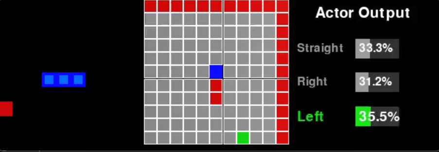

# About The Snake Game

This project implements the classic game of Snake, where a machine learning agent is trained to play.

## Gameplay

The objective of the game is for the snake (blue) to navigate the board and eat the food (red).

-   The snake is controlled by an AI agent.
-   The agent can choose one of three actions at each step: go straight, turn right, or turn left, relative to its current direction.
-   When the snake eats a piece of food, it grows longer, and the score increases.
-   A new piece of food appears at a random location on the board.

## Game Over Conditions

The game ends if any of the following conditions are met:
1.  The snake's head collides with the boundaries of the game window.
2.  The snake's head collides with any part of its own body.
3.  The snake wanders for too long without eating food. This is based on a configurable step limit that scales with the snake's length.

## Reward System

The AI agent is trained using a reward system to encourage desired behavior:

-   **`+10` points:** For successfully eating a piece of food.
-   **`-10` points:** As a penalty for losing the game (any game-over condition).
-   **`0` points:** For any other move that does not result in eating food or losing the game.

This reward structure incentivizes the agent to seek food while actively avoiding collisions and inefficient paths.

## State Representations

The agent "sees" the game world through a state representation. This project supports three different types of states, which can be configured in `config.yaml`.

### `vector`
This is a simple, compact 11-element vector containing boolean flags and distance information. It tells the agent:
- If there is immediate danger (wall or body) straight, right, or left.
- The snake's current direction (up, down, left, or right).
- The location of the food relative to the snake's head (e.g., food is up and to the left).

### `grid`
This representation provides the agent with a local `M x M` grid centered on its head (e.g., `11x11`). This gives the agent a "vision" of its immediate surroundings. Each cell in the grid can be one of three things:
- **Empty Space**
- **Food**
- **Wall or Snake Body**

To be fed into the neural network, this grid is "one-hot encoded". Each cell is converted from a single number into a 3-element vector. For example:
- Empty: `[1, 0, 0]`
- Food: `[0, 1, 0]`
- Wall/Body: `[0, 0, 1]`

This results in a final state size of `M * M * 3`.

### `raycast`
This representation mimics a form of Lidar. The agent casts "rays" in three directions relative to its heading: straight, right, and left. Each ray travels for `K` steps (e.g., 11 steps).
- For each step along a ray, the agent detects if it sees Empty Space, Food, or a Wall/Body.
- Similar to the `grid` state, this information is one-hot encoded into a 3-element vector for each step of each ray.

This results in a final state size of `3 (directions) * K (steps) * 3 (one-hot)`. This method gives the agent long-range, but narrow, vision.